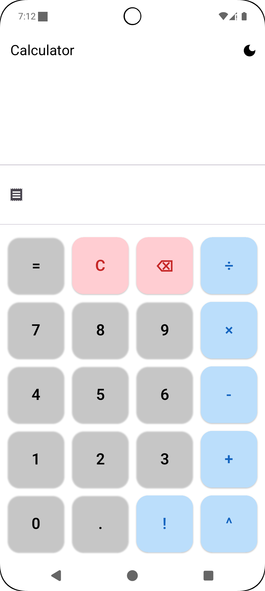
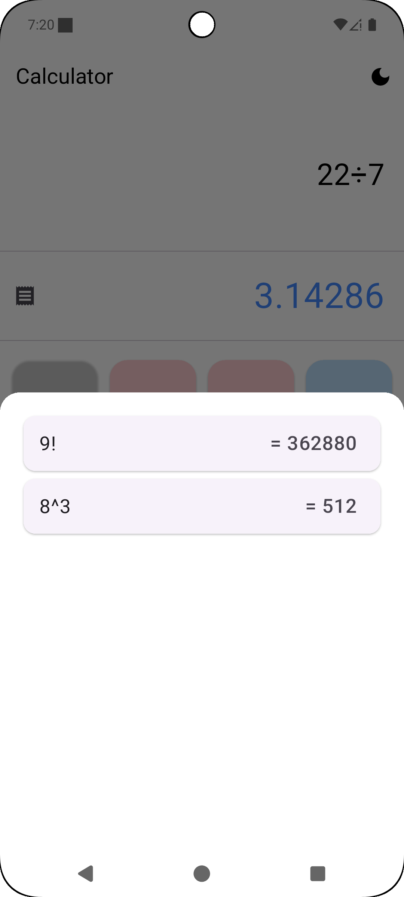
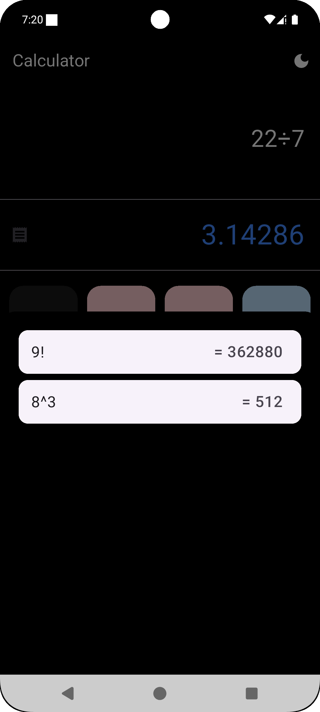
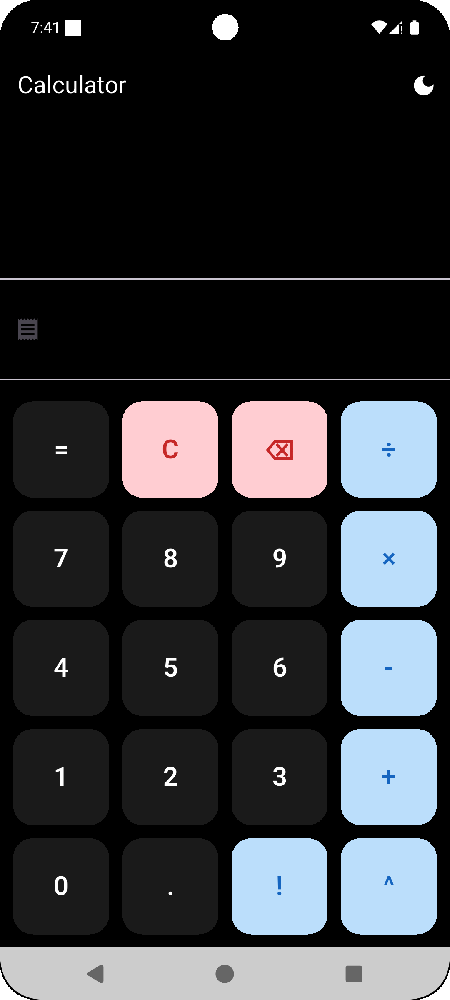

📱 Calculator App (Flutter)

A simple, elegant calculator app built with Flutter.
Supports basic arithmetic operations and real-time calculation preview — similar to modern smartphone calculators.

✨ Features
➕ Addition, ➖ Subtraction, ✖️ Multiplication, ➗ Division ❗ Factorial 🔼 Power

🔄 Live result preview without pressing =

⌫ Delete/backspace support

🌓 Clean UI that works in light & dark mode

📦 Getting Started
Make sure you have Flutter installed.

📸 Screenshots

🚀 Built With
Flutter – cross-platform UI toolkit

Dart – programming language

🤝 Contributing
Contributions, issues and feature requests are welcome!
Feel free to check issues page or submit a pull request.

⭐️ Show your support
If you like this project, give it a ⭐️ on GitHub!
